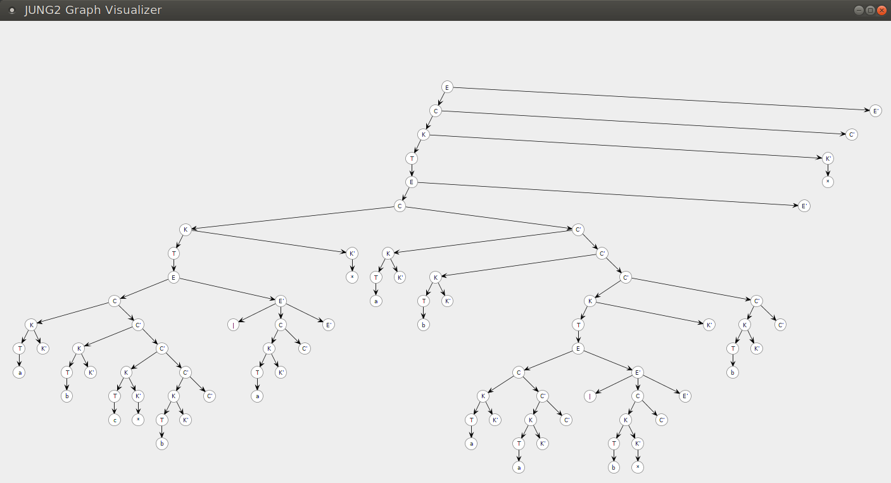

# Лабораторная работа №2<br>Ручное построение нисходящих синтаксических анализаторов

*Вариант 2. Регулярные выражения*

## Введение
Цель данной лабораторной работы — научиться разрабатывать грамматики для заданных неформально языков с учетом семантического смысла и приоритета операторов, разрабатывать лексические анализаторы, разрабатывать вручную нисходящие синтаксические анализаторы, разрабатывать подробные тестовые наборы для анализаторов.

## Разработка грамматики
**Задача:** требуется разработать контестно-свободную грамматику для языка регулярных выражений с операциями конкатенации (простая последовательная запись строк), выбора (вертикальная черта), замыкания Клини. Приоритет операций стандартный. Скобки могут использоваться для изменения приоритета.
Для обозначения базовых языков используются маленькие буквы латинского алфавита.

**Пример:** `((abc*b|a)*ab(aa|b*)b)*`

Сначала разработаем грамматику, исходя из структуры языка, чтобы она максимально близко соответствовала интуитивным представлениям о построении слов из языка.

```bnf
<E>  ::=  <E> "|" <C>        # Оператор выбора
       |  <C>                # или композиция

<C>  ::=  <C> <K>            # Композиция
       |  <K>                # или замыкание Клини/+
      
<K>  ::=  <T> "*"            # Замыкание Клини
       |  <T> "+"            # или оператор +
       |  <T>                # или идентификатор
      
<T>  ::=  "(" <E> ")"        # Выражение в скобках
       |  "a" | … | "z"      # или латинские буквы
```

В грамматике есть левая рекурсия и правое ветвление. Устраним их. Получится грамматика:

```bnf
<E>  ::=  <C> <E'>           # Операнд оператора выбора и продолжение

<E'> ::=  "|" <C> <E'>       # Продолжение оператора выбора
       |  "ε"                # или пустая строка

<C>  ::=  <K> <C'>           # Операнд композиции и продолжение

<C'> ::=  <K> <C'>           # Продолжение композиции
       |  "ε"                # или пустая строка
      
<K>  ::=  <T> <K'>           # Идентификатор и оператор Клини/+
       
<K'> ::=  "*"                # Оператор Клини
       |  "+"                # или оператор +
       |  "ε"                # или пустая строка

<T>  ::=  "(" <E> ")"        # Выражение в скобках
       |  "a" | … | "z"      # или латинские буквы
```

## Построение лексического анализатора

**Задача:** требуется написать лексический анализатор, который должен получать на вход строку и выдавать последовательность терминалов (токенов). Пробелы и переводы строк должны игнорироваться.

Терминалами в нашей грамматике являются маленькие буквы латинского алфавита, скобки и символы операторов.

Построим лексический анализатор. Создадим класс [`Token`](src/main/java/ru/ifmo/translators/Token.java) для хранения терминалов. Так как заданная грамматика предполагает конечное количество терминалов, заведём статический пул токенов, которые будем переиспользовать. Не забудем также про конец строки.

В файле [`LexicalAnalyzer`](src/main/java/ru/ifmo/translators/LexicalAnalyzer.java) приведен код лексического анализатора, решающего поставленную задачу.

## Построение синтаксического анализатора

**Задача:** требуется построить множества *FIRST* и *FOLLOW* для нетерминалов заданной грамматики. Затем написать синтаксический анализатор с использованием рекурсивного спуска.

Построим множества *FIRST* и *FOLLOW* для нетерминалов нашей грамматики:

|Нетерминал|*FIRST*      |*FOLLOW*                     |
|:--------:|:------------|:----------------------------|
|`<E>`     |`(` `a-z`    |`$` `)`                      |
|`<E'>`    |`|` `ε`      |`$` `)`                      |
|`<C>`     |`(` `a-z`    |`$` `)` `|`                  |
|`<C'>`    |`(` `a-z` `ε`|`$` `)` `|`                  |
|`<K>`     |`(` `a-z`    |`$` `)` `|` `(` `a-z`        |
|`<K'>`    |`*` `+` `ε`  |`$` `)` `|` `(` `a-z`        |
|`<T>`     |`(` `a-z`    |`$` `)` `|` `(` `a-z` `*` `+`|

Заведем структуру данных [`Tree`](src/main/java/ru/ifmo/translators/Tree.java) для хранения дерева. В файле [`RecursiveDescentParser`](src/main/java/ru/ifmo/translators/RecursiveDescentParser.java) приведен синтаксический анализатор с использованием рекурсивного спуска.

## Визуализация дерева разбора

**Задача:** требуется разработать систему визуализации дерева разбора для изучения результата.

Используем библиотеку [JUNG v2.1.1](https://github.com/jrtom/jung) для визуализации дерева разбора. На рисунке ниже представлен пример дерева разбора регулярного выражения `((abc*b|a)*ab(aa|b*)b)*`.



## Подготовка набора тестов

**Задача:** требуется подготовить набор исчерпывающих тестов для программы. По возможности следует добиться того, чтобы все возможные ошибки в грамматике или в лексическом/синтаксическом анализаторе ими покрывались. Про каждый тест необходимо дать короткое описание.

Набор тестов для задачи приведён в файлах [`LexicalAnalyzerTest`](src/test/java/ru/ifmo/translators/LexicalAnalyzerTest.java) и [`RecursiveDescentParserTest`](src/test/java/ru/ifmo/translators/RecursiveDescentParserTest.java).
